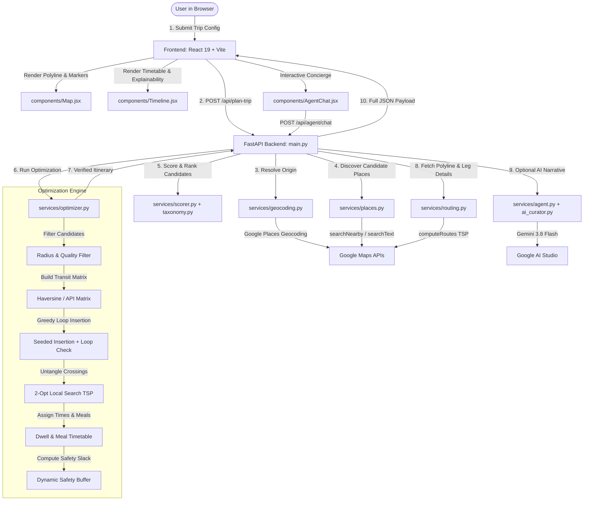

# Routi: Technical Architecture & Codebase Walkthrough

> **Document Type**: Comprehensive Engineering Walkthrough & Architectural Specification  
> **Audience**: Software Engineers, System Architects, and Autonomous AI Assistants inspecting, extending, or maintaining this codebase.  
> **Mission**: Build an AI-curated day trip planning engine that guarantees realistic schedules, round-trip loop closure, hard time budget adherence, and high venue quality by coupling **deterministic combinatorial optimization** with **Google Gemini conversational intelligence**.

---

## Table of Contents

1. [High-Level Architectural Philosophy](#1-high-level-architectural-philosophy)
2. [End-to-End System Architecture](#2-end-to-end-system-architecture)
3. [Project Directory & File Manifest](#3-project-directory--file-manifest)
4. [The Optimization & Scheduling Engine (`optimizer.py`)](#4-the-optimization--scheduling-engine-optimizerpy)
   - [4.1 Orienteering Problem (OP) Formulation](#41-orienteering-problem-op-formulation)
   - [4.2 The 6 Hard Constraints](#42-the-6-hard-constraints)
   - [4.3 Multi-Objective Scoring & Diversity Penalties](#43-multi-objective-scoring--diversity-penalties)
   - [4.4 Seeded Greedy Insertion Heuristic](#44-seeded-greedy-insertion-heuristic)
   - [4.5 2-Opt Local Search TSP Tour Optimization](#45-2-opt-local-search-tsp-tour-optimization)
   - [4.6 Meal Window & Dwell Time Scheduling](#46-meal-window--dwell-time-scheduling)
   - [4.7 Dynamic Safety Buffer Formulation](#47-dynamic-safety-buffer-formulation)
5. [The Autonomous AI Concierge Layer (`agent.py`, `tools.py`)](#5-the-autonomous-ai-concierge-layer-agentpy-toolspy)
   - [5.1 Grounding & Anti-Hallucination Guarantees](#51-grounding--anti-hallucination-guarantees)
   - [5.2 Tool Calling Interface](#52-tool-calling-interface)
   - [5.3 Conversational Re-Planning Engine (`/api/agent/chat`)](#53-conversational-re-planning-engine-apiagentchat)
6. [Place Intelligence & Taxonomy (`places.py`, `taxonomy.py`, `scorer.py`)](#6-place-intelligence--taxonomy-placespy-taxonomypy-scorerpy)
   - [6.1 Google Places API (New) Querying](#61-google-places-api-new-querying)
   - [6.2 Taxonomic Normalization & Iconic Landmarks](#62-taxonomic-normalization--iconic-landmarks)
   - [6.3 Bayesian Rating Smoothing Formula](#63-bayesian-rating-smoothing-formula)
7. [Routing & Navigation Layer (`routing.py`, `geocoding.py`)](#7-routing--navigation-layer-routingpy-geocodingpy)
   - [7.1 Google Routes API & TSP Optimization](#71-google-routes-api--tsp-optimization)
   - [7.2 Native Google Maps Navigation Export](#72-native-google-maps-navigation-export)
8. [Frontend Architecture (`React 19` + `Vite` + `Tailwind CSS`)](#8-frontend-architecture-react-19--vite--tailwind-css)
   - [8.1 State Management & Data Flow](#81-state-management--data-flow)
   - [8.2 UI Components Deep Dive](#82-ui-components-deep-dive)
9. [API Contract & Schema Reference](#9-api-contract--schema-reference)
10. [End-to-End Execution Flow (Lifecycle of a Request)](#10-end-to-end-execution-flow-lifecycle-of-a-request)

---

## 1. High-Level Architectural Philosophy

Travel planning applications typically suffer from one of two severe failure modes:

1. **Pure LLM Generation**: LLMs hallucinate travel times, invent non-existent venues, ignore speed limits and physical geography, and fail basic arithmetic (producing 14-hour itineraries for a 4-hour window).
2. **Pure Deterministic Solvers**: Rigid TSP algorithms select clustered, uninspiring venues, ignore subtle vibe preferences (e.g. *"artsy cafe with quiet seating"*), fail to handle meal times naturally, and lack natural-language adaptability.

**Routi bridges this gap through a strict Separation of Concerns**:

```
┌────────────────────────────────────────────────────────────────────────┐
│                      ROUTI DUAL-ENGINE ARCHITECTURE                     │
│                                                                        │
│   ┌──────────────────────────────────┐  ┌──────────────────────────┐  │
│   │   DETERMINISTIC OPTIMIZER        │  │     GEMINI AI CONCIERGE  │  │
│   ├──────────────────────────────────┤  ├──────────────────────────┤  │
│   │ • Mathematical OP / TSP Solver   │  │ • Natural Language Query │  │
│   │ • Strict Return Loop Feasibility │  │ • Conversational Chat    │  │
│   │ • Hard Time Budget Enforcement   │  │ • Vibe & Nuance Matching │  │
│   │ • Meal Scheduling & Dwell Rules  │  │ • Narrative Storytelling │  │
│   │ • Dynamic Safety Buffering       │  │ • Tool Calling Delegation│  │
│   └─────────────────┬────────────────┘  └─────────────┬────────────┘  │
│                     │                                 │               │
│                     ▼                                 ▼               │
│               [ Truth & Math ]                 [ Tone & Context ]     │
│                     │                                 │               │
│                     └────────────────┬────────────────┘               │
│                                      ▼                                │
│                       UNIFIED CLIENT-READY ITINERARY                  │
└────────────────────────────────────────────────────────────────────────┘
```

> **The Golden Rule**: *The LLM is NEVER permitted to calculate travel times, geographic distances, or determine schedule feasibility. All physical calculations and constraints are delegated to the deterministic optimizer.*

---

## 2. End-to-End System Architecture



---

## 3. Project Directory & File Manifest

```
Routi/
├── backend/
│   ├── main.py                     # FastAPI routes, CORS, request validation, pipeline entrypoints
│   ├── requirements.txt            # Python dependencies (FastAPI, Uvicorn, Google Generative AI, etc.)
│   ├── .env.example                # Backend environment configuration template
│   └── services/
│       ├── __init__.py             # Python package marker
│       ├── agent.py                # RoamAroundAgent: Gemini conversational concierge & re-planning engine
│       ├── ai_curator.py           # Gemini prompt builder for trip narratives and fallback plans
│       ├── geocoding.py            # Google Places API (New) address geocoding & autocomplete suggestions
│       ├── itinerary_generator.py  # User-friendly presentation layer with 10-dimension JSON contract
│       ├── optimizer.py            # Deterministic Orienteering Problem (OP) solver & 2-Opt TSP engine
│       ├── places.py               # Google Places API candidate discovery (Table A types, radius bounds)
│       ├── routing.py              # Google Routes API (computeRoutes, encoded polylines, directions URLs)
│       ├── scorer.py               # Bayesian rating smoothing, preference matching, diversity penalties
│       ├── taxonomy.py             # Place category taxonomy, iconic landmark identification, dwell rules
│       ├── time_manager.py         # Time budgeting, slot calculations, travel pacing
│       └── tools.py                # Deterministic tool suite consumed by RoamAroundAgent
│
├── frontend/
│   ├── index.html                  # HTML entry point
│   ├── package.json                # Dependencies (@react-google-maps/api, axios, tailwindcss, vite)
│   ├── vite.config.js              # Vite configuration
│   ├── tailwind.config.js          # Tailwind CSS design system tokens
│   ├── .env.example                # Frontend environment configuration template
│   └── src/
│       ├── App.jsx                 # Application layout, global state coordinator, error boundary
│       ├── main.jsx                # React root bootstrap
│       ├── index.css               # Global styles, scrollbar styling, animations
│       ├── components/
│       │   ├── AgentChat.jsx       # Floating AI Concierge conversational chat drawer
│       │   ├── Map.jsx             # Interactive Google Map (dark styling, SVG pins, polylines)
│       │   ├── SearchForm.jsx      # Trip input form (start location, duration, transport, vibe)
│       │   └── Timeline.jsx        # Chronological schedule, dwell time cards, explainability badges
│       └── utils/
│           └── polyline.js         # Polyline decoding utility for Google Routes overview_polyline
│
├── README.md                       # High-level overview, quickstart, and feature summary
└── WALKTHROUGH.md                  # This document: Comprehensive architecture specification
```

---

## 4. The Optimization & Scheduling Engine (`optimizer.py`)

The core of Routi is implemented in `backend/services/optimizer.py` (2,200+ lines). It formulates day trip generation as an **Orienteering Problem with Time Windows (OPTW)** and solves it using a combination of **Seeded Greedy Insertion** and **2-Opt Local Search**.

### 4.1 Orienteering Problem (OP) Formulation

Let $V = \{v_0, v_1, \dots, v_n\}$ be the set of places, where $v_0$ is the starting origin (and designated destination).
- Each candidate venue $v_i$ carries a non-negative score $S(v_i)$ and a visit dwell time $D(v_i)$.
- For every pair $(v_i, v_j)$, the transit time is $T(v_i, v_j)$.
- The user provides an available time budget $B$ in minutes.

The goal is to select a subset of venues $U \subseteq V \setminus \{v_0\}$ and an ordering $(v_{\pi(1)}, v_{\pi(2)}, \dots, v_{\pi(k)})$ to:

$$\max \sum_{i=1}^k S(v_{\pi(i)})$$

subject to the round-trip time budget constraint:

$$T(v_0, v_{\pi(1)}) + \sum_{i=1}^{k-1} \left( D(v_{\pi(i)}) + T(v_{\pi(i)}, v_{\pi(i+1)}) \right) + D(v_{\pi(k)}) + T(v_{\pi(k)}, v_0) + \text{Buffer}(k) \le B$$

### 4.2 The 6 Hard Constraints

The optimizer strictly enforces six non-negotiable invariants:

| # | Hard Constraint | Enforcement Mechanism |
|---|---|---|
| **1** | **Origin Start** | Route leg 0 strictly originates at the user's geocoded starting coordinates. |
| **2** | **Round-Trip Loop** | The final leg strictly returns to the starting coordinates ($v_{\pi(k)} \to v_0$). |
| **3** | **Hard Time Budget** | Total trip time (travel + dwell + safety buffer) cannot exceed available minutes. |
| **4** | **Guaranteed Return Reservation** | When testing candidate $v_{\text{cand}}$, the engine checks: `elapsed + travel(curr, cand) + dwell(cand) + travel(cand, start) + buffer <= available_time`. If false, candidate is rejected immediately. |
| **5** | **No Duplicate Places** | Venues are deduplicated by Google `place_id` and normalized name + geographic coordinates within 50 meters. |
| **6** | **No Unreachable Stops** | Candidate venues with transit time exceeding remaining slack are discarded. |

### 4.3 Multi-Objective Scoring & Diversity Penalties

Before insertion, each candidate place is evaluated by `services/scorer.py` using multi-factor Bayesian-smoothed scoring:

$$\text{TotalScore}(v) = w_r \cdot \text{BayesianRating}(v) + w_v \cdot \text{VibeMatch}(v) + w_p \cdot \text{ProximityScore}(v) - \text{Penalty}_{\text{cat}}(v)$$

- **Bayesian Rating**: Smoothes raw 1–5 star ratings based on total review count so a 5.0 star place with 2 reviews does not outrank a 4.7 star venue with 8,000 reviews.
- **Vibe Match**: Natural language token overlap and semantic keyword intersection against user-provided interests.
- **Category Repetition Penalty**: Each subsequent venue from an already-selected category receives an exponential diminishing-returns penalty:

$$\text{Penalty}_{\text{cat}}(c) = 0.35 \times (\text{count}(c))^2$$

This prevents itineraries from recommending 4 museums or 3 coffee shops in a single day.

### 4.4 Seeded Greedy Insertion Heuristic

```
1. Initialize itinerary = [Start_Location]
2. Rank all candidate places by initial Score.
3. Select highest-scoring place as initial seed anchor.
4. While available time remains:
     a. For each unvisited candidate c:
          i. Evaluate insertion into every possible position in the current tour.
          ii. Calculate delta_travel = travel(i-1, c) + travel(c, i) - travel(i-1, i)
          iii. Calculate total_needed = delta_travel + dwell(c) + buffer_delta
          iv. If (current_duration + total_needed) <= available_time:
                 efficiency_ratio = Score(c) / max(1.0, delta_travel)
                 Track best candidate with highest efficiency_ratio
     b. If a valid candidate is found:
          Insert into best position.
        Else:
          Break (no more candidates can fit with guaranteed return loop).
```

### 4.5 2-Opt Local Search TSP Tour Optimization

Greedy insertion can produce crossing route segments. The optimizer runs a **2-Opt Local Search** algorithm over the selected stops (keeping Start/End fixed):

```
repeat until no improvement:
    for i from 1 to k-1:
        for j from i+1 to k:
            delta = distance(i-1, j) + distance(i, j+1) - (distance(i-1, i) + distance(j, j+1))
            if delta < 0:
                reverse tour segment from i to j
```

This untangles path crossings and significantly reduces total transit time.

### 4.6 Meal Window & Dwell Time Scheduling

Routi avoids scheduling meals at unrealistic hours (e.g. lunch at 10:00 AM or 4:00 PM):

```
Lunch Window:   12:00 PM – 02:30 PM (Ideal target: 12:45 PM – 01:30 PM)
Dinner Window:  06:30 PM – 09:30 PM (Ideal target: 07:00 PM – 08:30 PM)
```

- **Meal Inclusion Logic**: If the itinerary overlaps lunch or dinner hours, the engine prioritizes inserting a top-rated dining venue into the matching time slot.
- **Dwell Time by Category** (`taxonomy.py`):
  - `museum / gallery`: 90–120 mins
  - `park / scenic viewpoint`: 45–60 mins
  - `historic landmark / temple`: 60–90 mins
  - `casual dining / lunch`: 60 mins
  - `sit-down dinner`: 75–90 mins
  - `cafe / bakery`: 35–45 mins

### 4.7 Dynamic Safety Buffer Formulation

To guarantee that travelers never miss their return deadline due to unexpected traffic or dwell overruns:

$$\text{SafetyBuffer} = \min\left(45, \; 10 + (\text{num\_stops} \times 4) + \text{ModeBuffer}\right)$$

Where:
- $\text{ModeBuffer}(\text{DRIVE}) = 10\text{ mins}$ (traffic variability)
- $\text{ModeBuffer}(\text{WALK}) = 5\text{ mins}$
- $\text{ModeBuffer}(\text{BICYCLE}) = 5\text{ mins}$

The resulting buffer (typically 15–30 minutes) is reported explicitly on the frontend timeline as peace-of-mind slack.

---

## 5. The Autonomous AI Concierge Layer (`agent.py`, `tools.py`)

The conversational layer (`services/agent.py`) implements `RoamAroundAgent`, powered by Google Gemini (with fallbacks: `gemini-2.5-flash`, `gemini-flash-latest`, `gemini-3.8-flash`).

### 5.1 Grounding & Anti-Hallucination Guarantees

When generating day-flow narratives or answering conversational chat queries, the agent operates under strict instructions:

1. **Zero Math Invention**: The LLM must not compute distances or transit durations; it only references the numbers produced by the optimizer.
2. **Fact Preservation**: Coordinates, ratings, categories, and arrival timestamps are copied directly from structured tool outputs.
3. **Transparent Explainability**: If a user asks *"Why wasn't the museum included?"*, the agent reads `rejected_destinations` and answers with mathematical precision (e.g. *"Adding the museum would require 75 minutes of dwell plus 22 minutes detour, which exceeds your remaining 35 minutes of time budget."*).

### 5.2 Tool Calling Interface

The agent has access to 4 deterministic tools defined in `backend/services/tools.py`:

```python
# 1. Place Search
search_places(query="coffee shops near me", lat=28.6139, lng=77.2090, radius_km=5.0)

# 2. Place Verification
get_place_details(place_id="ChIJ...")

# 3. Exact Routing
get_route(origin_lat=28.6139, origin_lng=77.2090, dest_lat=28.6562, dest_lng=77.2410, mode="DRIVE")

# 4. Route Optimization
optimize_trip(start_lat=28.6139, start_lng=77.2090, available_time_minutes=240, candidate_places=[...])
```

### 5.3 Conversational Re-Planning Engine (`/api/agent/chat`)

When the user types a prompt in the frontend chat drawer (e.g. *"Remove the restaurant"*, *"Add a nature stop"*, *"Make it 1 hour shorter"*), the request hits `POST /api/agent/chat`:

1. **Intent Classification**: Gemini determines if the message is conversational advice or an itinerary modification.
2. **Tool Execution**: If a change is needed (e.g. remove restaurant), the agent filters the current candidate set or adjusts duration parameters and calls `optimize_trip()`.
3. **Schedule Recalculation**: The optimizer re-runs 2-Opt TSP and timetable scheduling.
4. **Synchronized Response**: Returns both the conversational text answer and the full updated route object, triggering an immediate UI update on the Map and Timeline.

---

## 6. Place Intelligence & Taxonomy (`places.py`, `taxonomy.py`, `scorer.py`)

### 6.1 Google Places API (New) Querying

Routi utilizes the modern **Google Places API (New)** REST endpoints (`v1/places:searchNearby` and `v1/places:searchText`):

- **FieldMask Optimization**: Every API request specifies strict field masks to minimize latency and billing cost:
  `places.id,places.displayName,places.formattedAddress,places.location,places.rating,places.userRatingCount,places.priceLevel,places.primaryType,places.types`
- **Multi-Category Fetching**: Automatically batches queries across diverse categories (`tourist_attraction`, `historical_landmark`, `park`, `art_gallery`, `museum`, `restaurant`, `cafe`).

### 6.2 Taxonomic Normalization & Iconic Landmarks

`services/taxonomy.py` categorizes raw Google types into clean internal buckets:

```python
CATEGORY_LANDMARK    = "landmark"
CATEGORY_FOOD        = "restaurant"
CATEGORY_CAFE        = "cafe"
CATEGORY_NATURE      = "nature"
CATEGORY_CULTURE     = "culture"
CATEGORY_VIEWPOINT   = "viewpoint"
CATEGORY_WATERFRONT  = "waterfront"
CATEGORY_SHOPPING    = "shopping"
```

It also maintains an **Iconic Landmark Registry** (e.g. Taj Mahal, Red Fort, Golden Gate Bridge, Eiffel Tower) with verified baseline visit durations to prevent the optimizer from allotting inadequate time to major monuments.

### 6.3 Bayesian Rating Smoothing Formula

To eliminate biased outliers:

$$R_{\text{Bayes}} = \frac{C \cdot m + \sum r}{C + n} = \frac{C \cdot m + n \cdot \bar{r}}{C + n}$$

Where:
- $m = 4.2$ (prior global mean rating)
- $C = 25$ (confidence weight / minimum review threshold)
- $\bar{r} = \text{venue's average star rating}$
- $n = \text{total user review count}$

---

## 7. Routing & Navigation Layer (`routing.py`, `geocoding.py`)

### 7.1 Google Routes API & TSP Optimization

For final turn-by-turn routes and polylines, `services/routing.py` calls the **Google Routes API** (`v2:computeRoutes`):

- Sets `optimizeWaypointOrder: true` for server-side validation of waypoint sequences.
- Requests `polylineEncoding: ENCODED_POLYLINE` for network transmission.
- Extracts per-leg distance, duration, and step instructions.

### 7.2 Native Google Maps Navigation Export

Routi generates a native Google Maps Universal Directions URL formatted to open directly in the user's mobile Google Maps application:

```
https://www.google.com/maps/dir/?api=1&origin=28.6139,77.2090&destination=28.6139,77.2090&travelmode=driving&waypoints=28.6289,77.2065|28.6562,77.2410|28.6129,77.2295
```

Clicking **"Open Live Route in Google Maps"** launches turn-by-turn GPS navigation across all stops in the exact sequence curated by Routi.

---

## 8. Frontend Architecture (`React 19` + `Vite` + `Tailwind CSS`)

### 8.1 State Management & Data Flow

The frontend state is centralized in `src/App.jsx`:

```mermaid
flowchart LR
    SearchForm[SearchForm.jsx] -->|onSubmit(formData)| App[App.jsx]
    App -->|currentItinerary| Timeline[Timeline.jsx]
    App -->|currentItinerary + activeStop| Map[Map.jsx]
    App -->|currentItinerary + onUpdateRoute| AgentChat[AgentChat.jsx]
    Timeline -->|onSelectStop(id)| App
    Map -->|onMarkerClick(id)| App
```

### 8.2 UI Components Deep Dive

| Component | Key Responsibilities |
|---|---|
| **`App.jsx`** | Central state holder (`itinerary`, `activeStopId`, `isLoading`). Loads the Google Maps JavaScript API via `@react-google-maps/api`. Renders sticky dual-column desktop view. |
| **`SearchForm.jsx`** | Debounced place search suggestions (`/api/places/autocomplete`), time duration slider, 12h/24h start time picker with dynamic expected return clock, transport mode selector, interest tag toggles, and price tiers. |
| **`Timeline.jsx`** | Chronological vertical schedule. Shows arrival/departure timestamps, transit leg metrics (distance + travel mins), category badges, AI selection rationale tags, dwell time justifications, safety buffer alert, and rejected destinations drawer. |
| **`Map.jsx`** | Dark-mode Google Map (`#1e293b`). Renders numbered custom SVG map markers for each stop, departure flag, decoded route polyline, and interactive InfoWindows on click. |
| **`AgentChat.jsx`** | Floating AI Concierge drawer. Features quick-action prompt chips (e.g. *Remove Restaurant*, *Add Cafe*, *Make Shorter*) and natural-language chat that directly modifies the live itinerary. |

---

## 9. API Contract & Schema Reference

### 1. Unified Trip Planning

- **Endpoint**: `POST /api/plan-trip` (also available as `POST /api/generate-route`)
- **Headers**: `Content-Type: application/json`

#### Request Schema:

```json
{
  "start_location": {
    "lat": 28.6139,
    "lng": 77.2090,
    "address": "Connaught Place, New Delhi"
  },
  "available_time_minutes": 300,
  "start_time": "09:30 AM",
  "transport_mode": "DRIVE",
  "interests": ["Historic Landmarks", "Local Cuisine", "Photography"],
  "price_level": "$$"
}
```

#### Response Contract (Key Fields):

```json
{
  "success": true,
  "status": "success",
  "trip": {
    "title": "New Delhi Day Trip Loop",
    "total_duration_mins": 285,
    "total_travel_mins": 55,
    "total_dwell_mins": 210,
    "safety_buffer_mins": 20,
    "distance_km": 18.4,
    "transport_mode": "DRIVE",
    "start_clock": "09:30 AM",
    "end_clock": "02:15 PM",
    "return_to_start": true,
    "stops": [ ... ]
  },
  "optimized_places": [
    {
      "place_id": "ChIJ...",
      "name": "Humayun's Tomb",
      "lat": 28.5933,
      "lng": 77.2507,
      "arrival_time": "10:00 AM",
      "departure_time": "11:30 AM",
      "duration_mins": 90,
      "category": "landmark",
      "selection_reasons": ["Top Rated (4.6★)", "Historic Monument", "Proximity"],
      "ai_reasoning": "UNESCO World Heritage site with stunning Mughal architecture and tranquil gardens.",
      "time_estimate_reason": "Standard dwell time of 90 minutes for expansive monument grounds."
    }
  ],
  "polyline": "m`~bF...",
  "google_maps_url": "https://www.google.com/maps/dir/?...",
  "rejected_destinations": [
    {
      "name": "Qutub Minar",
      "reason": "Excluded: Detour travel time (38 mins) exceeds remaining slack."
    }
  ]
}
```

### 2. Conversational Agent Chat

- **Endpoint**: `POST /api/agent/chat`
- **Request Body**:

```json
{
  "message": "Can you swap the lunch spot for a vegetarian cafe?",
  "conversation_history": [ ... ],
  "current_itinerary": { ... },
  "start_location": { "lat": 28.6139, "lng": 77.2090 }
}
```

- **Response**: Returns message string, applied modification summary, and full `route_result` object to synchronize frontend state.

---

## 10. End-to-End Execution Flow (Lifecycle of a Request)

The following diagram details the exact step-by-step lifecycle from the moment a user clicks **"Plan My Day Trip"**:

```
[User Browser]
  │
  ├─► User enters "Connaught Place", selects 5 hours, DRIVE, and clicks "Plan My Day Trip".
  │
[Frontend SearchForm.jsx]
  ├─► Validates inputs & geocodes address if coordinates not already cached.
  ├─► Dispatches POST /api/plan-trip to FastAPI backend.
  │
[Backend main.py]
  ├─► Validates time budget (>= 45 mins) and coordinates.
  ├─► Calls services/places.py to query 50+ candidate venues from Google Places API (New).
  │
[Backend scorer.py + taxonomy.py]
  ├─► Normalizes categories (landmarks, cafes, dining, nature).
  ├─► Applies Bayesian smoothing to venue star ratings.
  ├─► Computes vibe and keyword relevance scores.
  │
[Backend optimizer.py]
  ├─► Selects top-scoring seed venue.
  ├─► Iteratively inserts candidates using value-to-detour ratio.
  ├─► Strictly enforces return loop transit reservation:
  │     elapsed + travel(curr, cand) + dwell(cand) + travel(cand, start) + buffer <= available_time
  ├─► Runs 2-Opt local search TSP to untangle intersecting legs.
  ├─► Inserts meal stop into 12:00 PM – 2:30 PM lunch window if applicable.
  ├─► Generates timetable with arrival and departure timestamps.
  │
[Backend routing.py]
  ├─► Calls Google Routes API (computeRoutes) to obtain exact encoded polyline & turn directions.
  ├─► Generates universal Google Maps directions link with waypoints.
  │
[Backend main.py ──► Frontend App.jsx]
  ├─► Returns JSON payload with stops, polylines, explainability tags, and safety buffer.
  │
[Frontend Map.jsx & Timeline.jsx]
  ├─► Timeline renders chronological stops with category icons and rationale badges.
  ├─► Map renders dark theme, numbered stop markers, and animated route polyline.
  │
[User Interactive Modification]
  └─► User opens AgentChat drawer: "Make it more relaxed".
        │
        └─► Re-runs optimizer with relaxed dwell times and returns updated schedule in real time.
```

---

*This document reflects the production architecture of Routi as of September 2026.*
