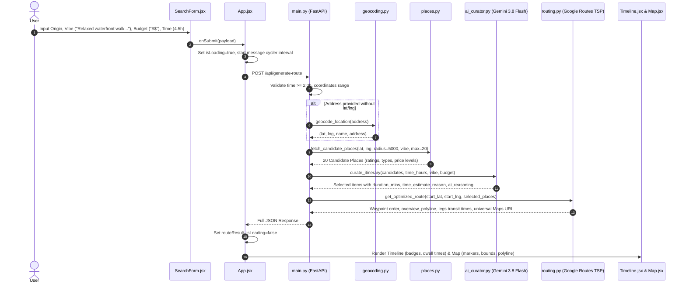

# Routi: Technical Architecture & Codebase Walkthrough for LLMs

> **Target Audience**: Large Language Models (LLMs), AI code assistants, autonomous agentic runtimes, and human software architects inspecting or modifying this codebase.  
> **Repository Purpose**: An AI-curated day trip planning engine that balances transit efficiency, venue vibes, budget tiers, and realistic visit dwell times using Google Places API (New), Google Routes API (TSP optimization), and Google Gemini (Gemini 3.8 Flash).

---

## 1. High-Level System Architecture

Routi is structured as a decoupled two-tier client-server application:

```
[ User Browser ]
       │
       ▼
[ Frontend (React 19 + Vite + Tailwind CSS) ]
  • SearchForm.jsx: Address autocomplete, vibe, budget, time inputs
  • App.jsx: Central state hub, cycling status, Google Maps JS API script loader
  • Timeline.jsx: Vertical itinerary, dynamic dwell times, AI rationale badges, Maps intent export
  • Map.jsx: Dark mode canvas, SVG markers, decoded polyline, custom InfoWindows
       │
       │ HTTP REST API (JSON)
       ▼
[ Backend (FastAPI + Uvicorn) ]
  • main.py: /api/generate-route, /api/places/autocomplete, /api/health
       │
       ├──► services/geocoding.py  ──► Google Places API (New: searchText)
       ├──► services/places.py     ──► Google Places API (New: searchNearby & searchText)
       ├──► services/ai_curator.py ──► Google Gemini API (gemini-3.8-flash)
       └──► services/routing.py    ──► Google Routes API (computeRoutes TSP)
```

---

## 2. Directory & File Manifest

```
/Users/shatadaldas/Developer/Projects/routi/
├── backend/
│   ├── .env                    # Secrets: GOOGLE_MAPS_API_KEY, GEMINI_API_KEY (gitignored)
│   ├── .env.example            # Environment template
│   ├── Procfile                # Web entrypoint for cloud PaaS (uvicorn main:app --host 0.0.0.0 --port $PORT)
│   ├── requirements.txt        # Python dependencies (fastapi, uvicorn, google-generativeai, requests, pydantic)
│   ├── main.py                 # FastAPI app, API router, request validation, pipeline orchestrator
│   └── services/
│       ├── __init__.py         # Package marker
│       ├── ai_curator.py       # Gemini 3.8 Flash prompt engineering, model fallbacks, dwell time estimation
│       ├── geocoding.py        # Location geocoding & autocomplete suggestions via Places API (New)
│       ├── places.py           # Candidate venue discovery (Table A types, radius filtering, price levels)
│       ├── routing.py          # Google Routes API (computeRoutes) TSP sequencing & Universal URL builder
│       └── time_manager.py     # Deterministic activity count and meal allocation heuristics
│
├── frontend/
│   ├── .env                    # Secrets: VITE_GOOGLE_MAPS_API_KEY, VITE_API_BASE_URL (gitignored)
│   ├── .env.example            # Frontend environment template
│   ├── index.html              # HTML5 entrypoint with Google Fonts (Inter)
│   ├── package.json            # React 19, @react-google-maps/api, axios, tailwindcss, vite
│   ├── vite.config.js          # Vite config with React plugin
│   ├── tailwind.config.js      # Custom theme colors and responsive breakpoints
│   └── src/
│       ├── App.jsx             # Top-level state manager, loading status cycler, split-pane layout
│       ├── main.jsx            # React root mount
│       ├── index.css           # Tailwind directives and custom scrollbar styling
│       ├── components/
│       │   ├── SearchForm.jsx  # Trip Vibe input, live suggestions, budget/time selectors
│       │   ├── Timeline.jsx    # Step-by-step timeline, AI rationale badges, Google Maps export
│       │   └── Map.jsx         # GoogleMap wrapper, dark-theme styles, markers, polylines, InfoWindows
│       └── utils/
│           └── polyline.js     # Decoding utility for Google encoded polyline strings
│
├── .gitignore                  # Git exclusions: node_modules, venv, .env, dist, package-lock.json
├── README.md                   # Human onboarding and quickstart guide
└── WALKTHROUGH.md              # This comprehensive system guide
```

---

## 3. End-to-End Execution Flow

When a user submits a trip request:



---

## 4. Detailed Component & Code Specifications

### 4.1 Backend Services

#### `backend/main.py`
- **Role**: Application entrypoint and HTTP API server.
- **CORS**: Configured via `fastapi.middleware.cors.CORSMiddleware` with `allow_origins=["*"]` to support cloud deployment.
- **Pydantic Model `RouteRequest`**:
  ```python
  class RouteRequest(BaseModel):
      start_lat: Optional[float] = None
      start_lng: Optional[float] = None
      address: Optional[str] = None
      time_hours: float
      cuisine: Optional[str] = None
      vibe: Optional[str] = None
      vibe_preference: Optional[str] = None
      price_level: Optional[str] = None
  ```
- **Endpoints**:
  - `GET /api/health`: Returns service status, checks presence of `GOOGLE_MAPS_API_KEY` and `GEMINI_API_KEY`.
  - `GET /api/places/autocomplete`: Queries `search_place_suggestions(query)` for live typeahead (minimum 2 chars).
  - `POST /api/generate-route`: Orchestrates geocoding $\to$ candidate gathering $\to$ Gemini curation $\to$ Routes TSP $\to$ response compilation.
- **Error Handling**: Throws `HTTPException(400)` for invalid coordinates or duration $< 2.0$ hours; `HTTPException(404)` if no places found; `HTTPException(502)` on upstream API failures.

#### `backend/services/geocoding.py`
- **`geocode_location(query: str)`**:
  - Uses Google Places API (New): `POST https://places.googleapis.com/v1/places:searchText`
  - FieldMask: `places.displayName,places.formattedAddress,places.location,places.id`
  - Resolves textual names (e.g. "San Francisco Ferry Building") into coordinates.
- **`search_place_suggestions(query: str)`**:
  - Live query autocomplete; returns up to 5 results with `place_id`, `name`, `address`, `lat`, `lng`.

#### `backend/services/places.py`
- **`fetch_candidate_places(...)`**:
  - Gathers up to 20 candidate venues within a 5km radius to provide diverse options for Gemini.
  - Queries `https://places.googleapis.com/v1/places:searchNearby` with valid **Table A** primary types:
    - `tourist_attraction`, `museum`, `park`, `art_gallery`, `cafe`, `restaurant`
    - *(Critical: `point_of_interest` and `historical_landmark` are NOT supported in `includedTypes` and will cause a 400 error)*.
  - Normalizes price levels using `PRICE_LEVEL_MAP`:
    - `PRICE_LEVEL_INEXPENSIVE` $\to$ `$ (Budget-Friendly)`
    - `PRICE_LEVEL_MODERATE` $\to$ `$$ (Moderate)`
    - `PRICE_LEVEL_EXPENSIVE` $\to$ `$$$ (Upscale)`
    - `PRICE_LEVEL_VERY_EXPENSIVE` $\to$ `$$$$ (Luxury)`
  - Fallback mechanism: Uses text search (`places:searchText`) or legacy Places API Nearby Search if New Places API returns empty.

#### `backend/services/ai_curator.py`
- **Model Hierarchy**:
  - Primary: `gemini-3.8-flash`
  - Graceful Fallback Cascade: `gemini-2.5-flash` $\to$ `gemini-1.5-flash` $\to$ `_fallback_curation()` (heuristic engine).
- **Prompt Structure**:
  - Passes total available time in minutes, requested vibe, budget tier, and JSON candidates.
  - Enforces `generation_config={"response_mime_type": "application/json"}`.
  - Instructs Gemini to estimate:
    - `duration_mins`: Realistic dwell time per venue (e.g., 30–45m for cafes/bakeries, 60–75m for parks/casual dining, 90–120m for major museums).
    - `time_estimate_reason`: One-sentence justification for the dwell time.
    - `ai_reasoning`: One-sentence explanation of why the venue matches the user's specific vibe and budget.
- **Output Schema Expected from Gemini**:
  ```json
  [
    {
      "place_id": "string",
      "duration_mins": 60,
      "time_estimate_reason": "Rationale for visit duration",
      "ai_reasoning": "Why this place matches vibe and budget"
    }
  ]
  ```

#### `backend/services/routing.py`
- **`get_optimized_route(start_lat, start_lng, places)`**:
  - Uses Google Routes API: `POST https://routes.googleapis.com/directions/v2:computeRoutes`
  - FieldMask: `routes.duration,routes.distanceMeters,routes.polyline.encodedPolyline,routes.legs,routes.optimizedIntermediateWaypointIndex`
  - Sets `travelMode: "DRIVE"`, `optimizeWaypointOrder: "true"` (TSP solver).
  - Handles the permutation returned in `optimizedIntermediateWaypointIndex` to reorder places into optimal driving sequence.
  - Parses leg durations and distances into human-friendly strings (e.g. `12 mins`, `2.4 km`).
  - Fallback: Calls legacy Google Directions API (`/maps/api/directions/json`) if Routes v2 fails.
- **`build_google_maps_directions_url(...)`**:
  - Builds Universal Google Maps Directions URL:
    `https://www.google.com/maps/dir/?api=1&origin={lat},{lng}&destination={lat},{lng}&travelmode=driving&waypoints={lat1},{lng1}|{lat2},{lng2}`
  - Respects waypoint constraints (up to 9 waypoints supported on desktop, 3 on mobile intent).

---

### 4.2 Frontend Architecture

#### `frontend/src/App.jsx`
- **Single Script Loader**: Utilizes `@react-google-maps/api`'s `useJsApiLoader` once at the application root, passing `isLoaded` and `loadError` down to prevent script collision errors.
- **Intelligent Loading States**:
  - An interval hook automatically cycles through progressive state messages every 2.2 seconds while `isLoading === true`:
    1. `"Scanning nearby spots..."`
    2. `"AI is curating your vibe..."`
    3. `"Estimating realistic dwell times..."`
    4. `"Optimizing the driving route..."`
- **Layout Management**:
  - Two-column split-pane layout on desktop (`lg:grid-cols-12`: 5 cols for controls/timeline, 7 cols for sticky map).
  - Clean vertical stacking on mobile (`order-1` controls/timeline, `order-2` map).

#### `frontend/src/components/SearchForm.jsx`
- **Trip Vibe**: Full text input with placeholder `"e.g., Relaxed waterfront walk and spicy food, no rushing."` and quick-select chips (`"Relaxed waterfront walk & spicy food"`, `"Scenic viewpoints & artisan coffee"`, `"Art galleries & quiet cafes"`, `"Local street food & markets"`).
- **Autocomplete**: Debounced input (280ms) calling `/api/places/autocomplete` with click-outside detection.
- **Preset Origins**: Quick-launch buttons for San Francisco, New York, and London.
- **Budget Selection**: Segmented buttons for `$` (Budget), `$$` (Moderate), and `$$$` (Upscale).
- **Time Slider**: Interactive range slider from 2.0 to 12.0 hours with step increments of 0.5 hours.

#### `frontend/src/components/Timeline.jsx`
- **Structure**: Vertical step-by-step timeline connecting the departure point, intermediary stops, transit legs, and return point.
- **Dynamic Dwell Times**: Displays `{place.duration_mins} mins` instead of static hour blocks.
- **AI Badges**:
  - Rationale Badge: `✨ AI Chose this: {place.ai_reasoning}` styled in indigo/amber glassmorphism.
  - Timing Rationale: `Timing: {place.time_estimate_reason}` displaying why dwell time was chosen.
- **Navigation Export**: Direct button triggering `window.open(googleMapsUrl, '_blank')` to launch Google Maps in native app or browser with all waypoints pre-loaded.

#### `frontend/src/components/Map.jsx`
- **Theme**: Dark mode custom JSON styling (`#1e293b` roads/land, `#090d16` water).
- **Markers**:
  - Origin/Destination: Emerald SVG pin with white core dot.
  - Restaurants/Dining: Amber SVG pin with cutlery glyph.
  - Attractions/Sightseeing: Purple SVG pin with star glyph.
- **Polyline & Bounds**:
  - Decodes `overview_polyline` via `decodePolyline()`.
  - Automatically bounds map viewport using `window.google.maps.LatLngBounds` whenever new coordinates load.
- **Custom InfoWindow**: Shows rating, price level, address, and `⏱️ AI Estimated Stay: {duration_mins} mins`.

---

## 5. API Contracts & Data Schemas

### Request: `POST /api/generate-route`
```json
{
  "address": "San Francisco Ferry Building",
  "start_lat": 37.7955,
  "start_lng": -122.3937,
  "time_hours": 4.5,
  "vibe": "Relaxed waterfront walk and spicy food, no rushing.",
  "price_level": "$$"
}
```

### Response: `POST /api/generate-route`
```json
{
  "status": "success",
  "message": "AI-curated route generated successfully",
  "curator_model": "gemini-3.8-flash",
  "vibe": "Relaxed waterfront walk and spicy food, no rushing.",
  "vibe_preference": "Relaxed waterfront walk and spicy food, no rushing.",
  "price_level": "$$",
  "start_location": {
    "name": "San Francisco Ferry Building",
    "address": "1 Ferry Building, San Francisco, CA 94105",
    "lat": 37.7955,
    "lng": -122.3937
  },
  "optimized_places": [
    {
      "place_id": "ChIJ...",
      "name": "Oracle Park",
      "lat": 37.7786,
      "lng": -122.3893,
      "duration_mins": 60,
      "duration_hours": 1.0,
      "time_estimate_reason": "60 minutes estimated for scenic walking trails and skyline viewpoints.",
      "ai_reasoning": "Top waterfront spot matching your relaxed walking preference.",
      "type": "tourist_attraction",
      "rating": 4.7,
      "price_level": "$$ (Moderate)",
      "address": "24 Willie Mays Plaza, San Francisco, CA"
    }
  ],
  "total_trip_time": "4.5 hours",
  "total_trip_hours": 4.5,
  "polyline": "encoded_polyline_string...",
  "google_maps_url": "https://www.google.com/maps/dir/?api=1&origin=...",
  "legs": [
    {
      "start_address": "San Francisco Ferry Building",
      "end_address": "Oracle Park",
      "duration_mins": 12,
      "duration_text": "12 mins",
      "distance_meters": 2300,
      "distance_text": "2.3 km"
    }
  ],
  "is_mock": false
}
```

---

## 6. Critical Technical Constraints & Edge Cases

1. **Google Places API (New) FieldMasks & Types**:
   - `searchNearby` and `searchText` strictly require the `X-Goog-FieldMask` header. Omitting this header returns empty or erroneous responses.
   - `includedTypes` only accepts primary types from **Table A** (e.g. `tourist_attraction`, `park`, `museum`, `restaurant`). Types like `point_of_interest` or `historical_landmark` will fail with `400 INVALID_ARGUMENT`.
2. **Gemini Rate Limits & Resilience**:
   - Free tier Gemini Flash models enforce a 5 Requests Per Minute (RPM) ceiling.
   - `ai_curator.py` wraps calls in an exception handler that cascades through `gemini-3.8-flash` $\to$ `gemini-2.5-flash` $\to$ `gemini-1.5-flash` before gracefully falling back to deterministic heuristic curation.
3. **Google Routes TSP Reordering**:
   - The Routes API returns `routes.optimizedIntermediateWaypointIndex` as an array of original index permutations (e.g. `[1, 0]`). The backend explicitly remaps the places array using this index order before returning.
4. **Google Maps Intent Restrictions**:
   - The universal navigation link uses `travelmode=driving`. Waypoints are joined with pipe `|` separators and URL-encoded. Mobile browsers limit native map URL intents to 3 waypoints; desktop supports up to 9.
5. **No Script Duplication in React**:
   - Never load `@react-google-maps/api` or the Google Maps `<script>` in both `App.jsx` and child components (`SearchForm`, `Map`). Maintain one single loader instance via `useJsApiLoader` in `App.jsx`.

---

## 7. How to Run & Verify

### Environment Variables
- `backend/.env`:
  ```env
  GOOGLE_MAPS_API_KEY=AIzaSy...
  GEMINI_API_KEY=AIzaSy...
  ```
- `frontend/.env`:
  ```env
  VITE_GOOGLE_MAPS_API_KEY=AIzaSy...
  VITE_API_BASE_URL=http://localhost:8000
  ```

### Startup Commands
```bash
# Terminal 1: Backend
cd backend
python3 -m venv venv && source venv/bin/activate
pip install -r requirements.txt
uvicorn main:app --host 0.0.0.0 --port 8000 --reload

# Terminal 2: Frontend
cd frontend
npm install
npm run dev -- --host
```

### Verification Checklist
- [x] Autocomplete returns suggestions for partial inputs.
- [x] Custom Trip Vibe text is transmitted to the backend.
- [x] Cycling loading indicators display on frontend during calculation.
- [x] Gemini curates venues and estimates dynamic visit durations in minutes.
- [x] Timeline renders `✨ AI Chose this:` rationale badge and `Timing:` explanation for each stop.
- [x] "Open in Google Maps" opens the multi-stop route in Google Maps.
- [x] Responsive layout stacks vertically on mobile viewports (<640px).
